  

As I make my annual/bi-annual trek back up to Canada, I had the 
opportunity to meet many friends (not much family since they are all in China). 
Among these opportunities was the long-dreaded annual family friends gatherings.
As a kid, I hated these gathering. To be honest, as a *pseudo-adult*, these 
gatherings are not much more fun. The part that makes these gatherings less fun
are the mandatory small talk segments. 

Personally, I don't think small talks are particular bad. One specific reason
I don't like them is because I suck at them. Generally, the below conversation is 
how one of my small talk conversations goes. 

```mermaid
sequenceDiagram
	rect rgb(230, 230, 255)
		PersonA->>PersonB: Hello! How are you? Crazy weather huh?
		PersonB->>PersonA: Yeah crazy weather these days, wish I was somewhere warm.
		PersonA->>PersonB: Same here.
		PersonB->>PersonA: How's your year?
		PersonA->>PersonB: Good, how's yours?
		PersonB->>PersonA: Good!
		PersonA->>PersonB: Crickets
		PersonB->>PersonA: 🦗🦗🦗
	end
```

Scarred by the past week's socially awkward moments, I have made a
goal to improve on my small talk abilities. It is time to squash
some crickets. While I am talking about new year resolutions, here is a complete 
list of my new year resolutions for 2025.

> Tom's Resolutions for 2025 and Beyond [!tip]
> 
> 1. Have more meaningful small talks
> 2. Dive head first into more things without hesistating (maybe not a good idea)
> 3. Play less League of Legends (like way less)
> 4. Exercise way more (don't be this guy -> 🥔)
> 5. TBH just complete one or two of these

Happy late 2025 and here's to hoping that I accomplish any of these goals for 2025.